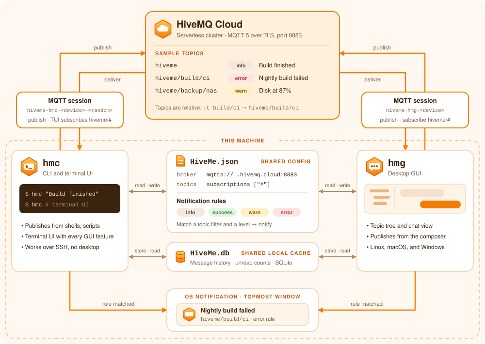

# HiveMe

[](https://github.com/caoccao/HiveMe/actions/workflows/linux_build.yml) [](https://github.com/caoccao/HiveMe/actions/workflows/macos_build.yml) [](https://github.com/caoccao/HiveMe/actions/workflows/windows_build.yml)

HiveMe is a pair of desktop applications for your own
MQTT topics, built on [HiveMQ Cloud](https://www.hivemq.com/).

* **`hmc`**, a CLI that sends a message from a shell or a script. Run on its own in a
  terminal, it opens a terminal UI with everything the GUI has, for a server or an SSH
  session with no desktop.
* **`hmg`**, a GUI that watches your topics, keeps a local history, and raises OS
  notifications from rules.

Both share one config file and one JSON message format, and both run on Linux, macOS,
and Windows.

> **Status:** both applications are built and documented, `hmc` with its terminal UI.
> There is no published release yet, so build from source; the packaging is described in
> [docs/installation.md](docs/installation.md) and the remaining work in
> [docs/todos.md](docs/todos.md).

## How it works



* **One cluster in the middle.** `hmc` and `hmg` each open their own MQTT session with
  your HiveMQ Cloud cluster, under their own client ID, so both can be connected at
  once. Whatever one publishes, the other receives.
* **Topics live under `hiveme`.** `hmc "Build finished"` goes to `hiveme`, and
  `hmc -t build/ci "…"` goes to `hiveme/build/ci`. Every topic shows up in the topic
  tree on its own.
* **One config, one cache.** Both read and write `HiveMe.json`, so the cluster,
  subscriptions, and notification rules are set up once. `hmg` and the terminal UI keep
  their message history in `HiveMe.db`, so a restart loses nothing and both show the
  same topics.
* **Rules decide what pops up.** A rule matches a topic filter and a level (`info`,
  `success`, `warn`, or `error`) and raises an OS notification, a topmost window, or
  both.

## Quick start

From nothing to your first notification in about ten minutes. All you need is a free
HiveMQ Cloud account.

### 1. Create a free cluster

1. Sign up at [hivemq.com](https://www.hivemq.com/) and create a **Serverless**
   cluster. It is free, and it is the plan HiveMe supports today.
2. On the cluster's **Overview** tab, copy the **TLS MQTT URL**. It looks like
   `abc123.s1.eu.hivemq.cloud:8883`.
3. On the **Access Management** tab, open **Credentials**, choose **Edit**, then
   **Add Credentials**, and save a username and a password.

> [!TIP]
> New credentials can take up to a minute to become active. If the first connection
> is refused, wait a minute and press **Connect** on the toolbar.

### 2. Install HiveMe

Download the installer for your platform from the
[Releases](https://github.com/caoccao/HiveMe/releases) page. Every installer contains
both `hmg` and `hmc`. On Linux, the deb and rpm packages put `hmc` on your `PATH`; on
macOS and Windows, [docs/installation.md](docs/installation.md#what-is-published) says
where to find it.

<details>
<summary>Build from source instead</summary>

```sh
pnpm install
cargo build -r -p hmc  # the CLI, at target/release/hmc
pnpm tauri build       # the installer for this OS, with both apps, under target/release/bundle/
```

[docs/development.md](docs/development.md#commands) lists every command.

</details>

### 3. Connect to your cluster

Pick the app you want to start with. Both save automatically when you pause typing, and
both use the same config file, so you only do this once per machine.

**On the desktop, with `hmg`:** open HiveMe, press **F10** for **Settings**, choose
**Broker**, and fill in:

| Field | What to enter |
|-------|---------------|
| Protocol | Leave it on **TLS MQTT** |
| URL | The TLS MQTT URL from step 1, pasted as it is |
| Username | The username from step 1 |
| Password | The password from step 1 |

**In a terminal, with `hmc`:** run `hmc` with nothing after it. The first time, it opens
on the same Broker fields with the cursor in **URL**. Paste the URL, press **Tab** for
the username and again for the password.

Either way, the status bar at the bottom turns to **connected**. There is nothing to set
up for TLS, and no `mqtts://` to type.

> [!TIP]
> In the terminal UI, **Alt+1** opens Messages, **F10** opens Settings, **?** lists
> every key, and **Ctrl+Q** quits.

### 4. Set up the CLI

Skip this step if you connected with `hmc` in step 3. It is already set up.

In `hmg`, under **Settings** > **Broker**, press **Copy CLI setup**. Paste the command
into a terminal and run it. It starts with `hmc --init` and carries everything `hmc`
needs, and it replies whether the config was created, updated, or already up to date.

Use the same button to set up `hmc` on another machine, such as a build server.

> [!WARNING]
> The copied command contains your password in plain text. Paste it straight into a
> terminal. Do not commit it, or share it.

### 5. Send your first message

```sh
hmc "Build finished"                          # info, on hiveme
hmc --level success "Deploy complete"         # success, on hiveme
hmc --level warn "Disk at 87%"                # warn, on hiveme
hmc --level error -t build/ci "Tests failed"  # error, on hiveme/build/ci
```

`hmc` replies `Message sent to <topic>.`, and the message appears right away in `hmg`
or the terminal UI, under its topic in the tree. To reply from either app, type in
the box at the bottom and press **Enter**.

### 6. Turn on notifications

Notifications are off until you choose which messages deserve one. Open **Settings** >
**Notifications**:

1. Keep **Raise OS Notifications** checked. Also check **Raise Topmost Window
   Notifications** if you want a window that stays above the others.
2. In each rule you care about, such as `warn` and `error`, check **OS Notification**,
   **Topmost Window**, or both.

Send `hmc --level error "Tests failed"` again, and your desktop tells you.

### Put it to work

Add `hmc` to the end of anything that takes a while:

```sh
make test && hmc --level success "Tests passed" || hmc --level error "Tests failed"
```

A build, a backup, or a cron job now tells you when it is done, on every machine
running HiveMe.

Something not working? [docs/development.md](docs/development.md#troubleshooting) lists
the usual causes and fixes.

## Documentation

* [Specifications](docs/specs/app.md)
  * [Config](docs/specs/config.md)
  * [Message format](docs/specs/message.md)
  * [CLI](docs/specs/cli.md)
  * [GUI](docs/specs/gui.md)
  * [Terminal UI](docs/specs/tui.md)
  * [Shared session](docs/specs/session.md)
  * [HiveMQ Cloud](docs/specs/hivemq-cloud.md)
* [Initialization plan](docs/plans/plan-initialization.md)
* [Terminal UI plan](docs/plans/plan-terminal-ui.md)
* [Development](docs/development.md)
* [Installation](docs/installation.md)
* [Release Notes](docs/release_notes.md)
* [Screenshots](docs/screenshots.md)
* [TODOs](docs/todos.md)

## License

[APACHE LICENSE, VERSION 2.0](LICENSE)
